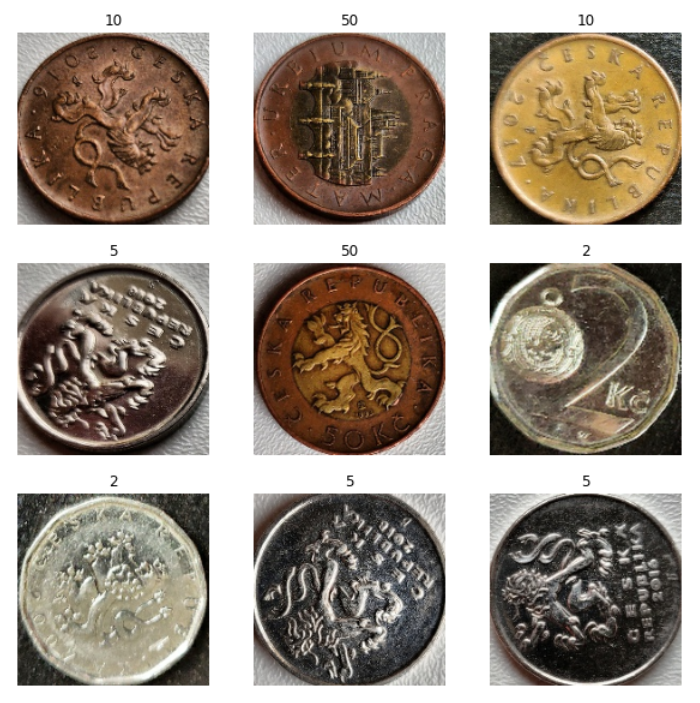

# Mobile Coin Detector (PV162 Project)

This is a set of modules for CZK coin detection on Android.

| Android App UI | Training dataset sample |
| ------ | ------ |
|  |  |

The project consists of three modules:

### 01 Extract Circles

This is a python file which takes a class of original photos (`CLASS`) as input (`ORIGINAL_DIR_PATH`), extracts circles from these photos, and stores them into the appropriate class folder in `TRAIN_DIR_PATH`.

### 02 CNN

Here, you can find a jupyter notebook, which trains a simple CNN model and export it into a *model.tflite* file for further use.

**CNN Architecture:**

#### 

### 03 Android App

This module contains two projects:

- **tf_object_detection** - this is the [**TensorFlow Lite Object Detection Android Demo**](https://github.com/tensorflow/examples/tree/master/lite/examples/object_detection/android) customized for the purposes of this project
- **OpenCVDemo** - this is just a demo project for getting familiar with importing OpenCV to Android Studio
  - it is not relevant for the project at the moment, but I decided to still keep it in this repository in case of not using the Tensorflow template and implementing it manually by myself.

## Build Instructions

### Prerequisites

- anaconda (mini)
  - used in **01 Extract Circles** and **02 CNN**
  - create an environment from the *requirements.txt* file
- OpenCV 411
  - download from [here](https://sourceforge.net/projects/opencvlibrary/files/4.1.1/)
  - to install, follow [this tutorial](https://android.jlelse.eu/a-beginners-guide-to-setting-up-opencv-android-library-on-android-studio-19794e220f3c)
